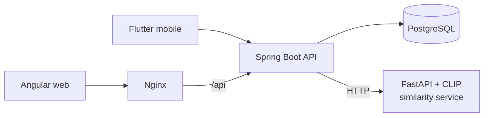
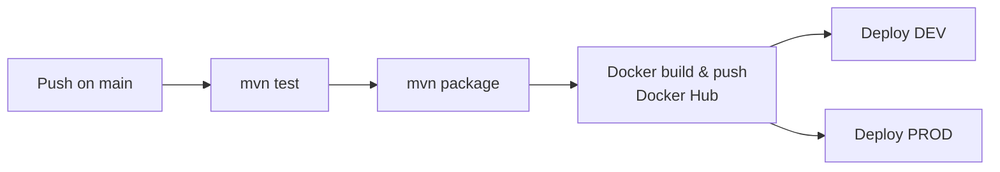

# 🏙️ Urban Alerts — Spring Boot API

> Backend of **Urban Alerts**, a civic incident reporting & management platform (ENIAD Berkane end-of-year project). Citizens report urban problems, agents intervene, supervisors track performance.

[](https://github.com/ahmedaminefaiz/springboot-api/actions/workflows/ci-cd.yml)


🌐 **Live:** [urbain-alerts.crafters.dev](https://urbain-alerts.crafters.dev)

Related repos: [angular-frontend](https://github.com/ahmedaminefaiz/angular-frontend) · [python-FastApi](https://github.com/ahmedaminefaiz/python-FastApi) (AI similarity service)

---

## ✨ Features

- 🔐 JWT authentication & role-based access: **citizen, agent, super-agent, admin**
- 📍 Problem reports with photos, geolocation and configurable problem types
- 🛠️ **Interventions** workflow — agents post updates (mandatory report, status, photos, computed durations); closing (`CLOTUREE`) reserved to super-agents
- 🔔 Real-time notifications (WebSocket / STOMP)
- 📊 KPIs for supervisors
- 🤖 Calls the **CLIP similarity microservice** to flag duplicate reports
- 🗃️ Schema versioned with **Flyway**; DTO mapping with **MapStruct**

## 🏗️ Architecture



Packages: `controller` · `service` · `repository` · `entity` · `dto` · `config` · `filter` · `exception`

## ⚙️ CI/CD pipeline (GitHub Actions)



- **CI** — Java 21, run the test suite, build the JAR
- **CD** — build & push the Docker image, then trigger **DEV** and **PROD** deployments (Dokploy)
- Immutable **commit-SHA image tags** to avoid race conditions between deployments
- Optimised Dockerfile: JRE runtime, non-root user, container-aware JVM flags, layer caching

## ▶️ Run locally

```bash
# PostgreSQL
docker run -d --name ua-pg -e POSTGRES_PASSWORD=postgres -p 5432:5432 postgres:16

./mvnw spring-boot:run
./mvnw test
```

---

👤 **Ahmed Amine Faiz** · [GitHub](https://github.com/ahmedaminefaiz)
